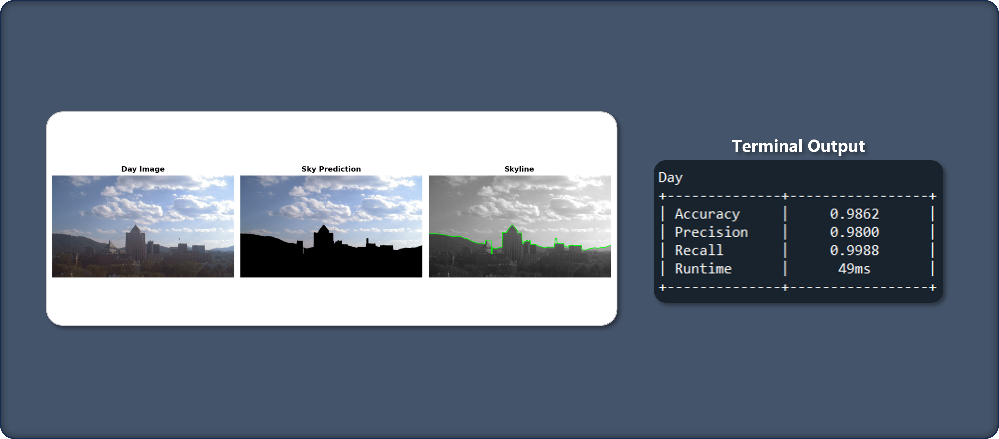

# Sky Region Detection Using Computer Vision

## Introduction

An edge-based sky region segmentation and skyline extraction algorithm. Utilizes Canny edge detection, time of day classification and skyline refinement to improve detection performance for diverse illumination and image conditions.

 Inspired by [Sky Region Detection in a Single Image for Autonomous Ground Robot Navigation](https://journals.sagepub.com/doi/full/10.5772/56884). 

## Run Procedure

The `Main.py` file is run to test the detection algorithm. <br>
<br>
Before running, please ensure that directory contents are according specifications provided in the [section below](#project-directory-structure). <br>
The modifiable parameters that can be customized in the code before running are as follows:

- `IMG_PER_DATASET`: Specify the number of images to load and process from each camera dataset.
- `SHOW_RESULTS`: If set to `True`, results of the sky region detector will be displayed after each prediction.
- `RANDOM_SEED`: The random seed value used for reproducibility when randomly selecting images.

```python
# Modifiable parameters for testing
IMG_PER_DATASET = 10
SHOW_RESULTS = True
RANDOM_SEED = 333
```

## Project Directory Structure 

The project directory contains the following folders and files:
```python
Root/
├── Skyfinder Dataset/
│   ├── 623/
│   ├── 684/
│   ├── 9730/
│   ├── 10917/
│   ├── 623-mask.png
│   └── ...
│
├── Main.py
├── SkyRegionDetector.py
├── PredictionData.py
├── DayNightClassifier.py
├── ImgUtils.py
└── README.md
```

### Sub-directories

#### Skyfinder Dataset
- Contains subdirectories for each camera dataset (`"623"`, `"684"`, `"9730"`, `"10917"`)
- Ground truth masks with the naming convention: `[camera number]-mask.png`
- This folder contains only subsets of 10 images from each dataset.
<p>&nbsp;</p>

### Modules

| File                   | Description                                                                      |
|------------------------|----------------------------------------------------------------------------------|
| Main.py                | The primary code to run for testing and evaluating the detection algorithm.      |
| SkyRegionDetector.py   | Contains the functions used for sky region prediction and visualization.         |
| PredictionData.py      | Defines data structures for storing detection and evaluation results.            |
| DayNightClassifier.py  | Classifier for predicting image time of day based on mean intensity value.       |
| ImgUtils.py            | Utility functions for randomly loading or copying image files from a directory.  |
